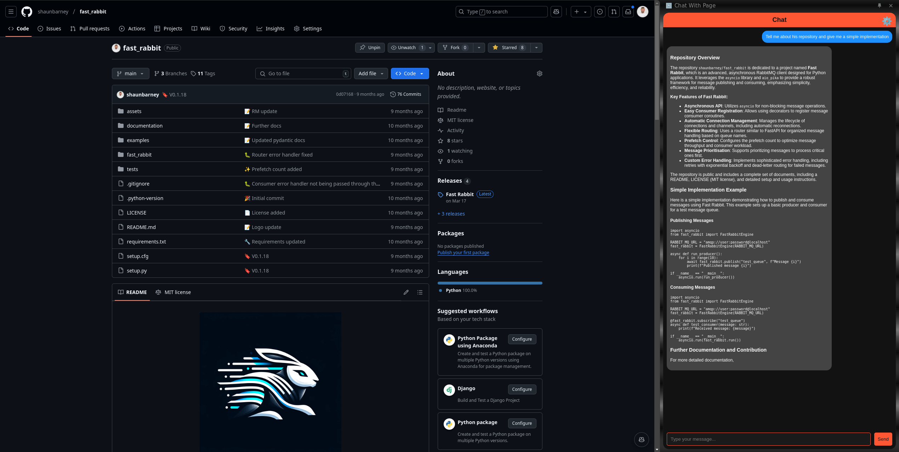
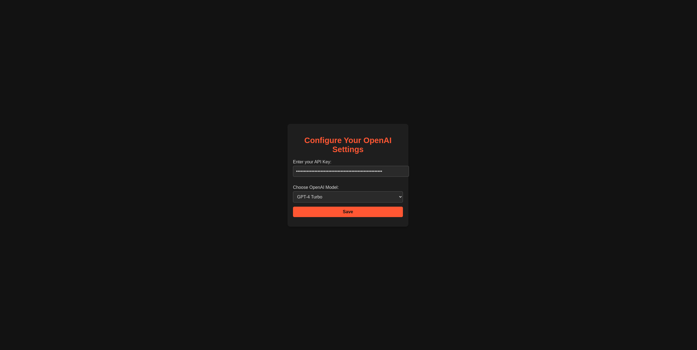

# Chat With Page Chrome Extension

<div align="center">
  
  <p>
    <strong>Release Date:</strong> December 2024<br>
    <strong>Developed by:</strong> Dr. Shaun Barney
  </p>
</div>

---

## Overview
The *Chat With Page* Chrome Extension allows users to interact with OpenAI's GPT models, providing insightful responses based on the content of the webpage they are viewing. With this extension, you can ask contextual questions or request explanations, all directly from your browser.

---

## Features
- Analyze the content of a webpage and get contextual answers.
- Integrate seamlessly with OpenAI's GPT API for intelligent responses.
- Choose from multiple OpenAI models to tailor the response style and cost:
  - **GPT-4**
  - **GPT-4 Turbo**
  - **GPT-4 Omega**
  - **GPT-3.5 Turbo**
- Simple and intuitive user interface for easy interaction.

---

## Installation Guide

### 1. **Download or Clone the Extension**
- Download the source files for this extension from the repository or provided ZIP file.
- Ensure the folder structure contains the following:
  ```
  /extension
    ├── manifest.json
    ├── sidepanel.html
    ├── settings.html
    ├── chat.js
    ├── settings.js
    ├── libs/
    │   └── marked.min.js
    ├── icons/
    │   └── icon.png
    ├── imgs/
    │   ├── main.png
    │   ├── settings.png
  ```

### 2. **Enable Developer Mode in Chrome**
1. Open Chrome.
2. Navigate to `chrome://extensions/`.
3. Toggle the **Developer Mode** switch (top right corner).

### 3. **Load the Extension**
1. Click on **Load unpacked**.
2. Select the folder containing the extension's files.
3. The extension should now appear in the extensions list with its icon in the Chrome toolbar.

---

## Setting Up the OpenAI API Key and Model

### 1. **Create an OpenAI Account**
- Visit [OpenAI](https://platform.openai.com/) and sign up for an account if you don’t already have one.

### 2. **Generate an API Key**
1. Log in to your OpenAI account.
2. Click the **cogwheel** icon in the top right to access account settings.
3. Navigate to the **API Keys** section.
4. Create a new API key by clicking the **Create new secret key** button.
5. Copy the generated key and save it securely (you won’t be able to view it again later).

### 3. **Ensure Sufficient Account Balance**
- Make sure your OpenAI account has funds available for API usage. The API charges based on the number of tokens processed in a request/response.

### 4. **Add Your API Key and Select a Model**
1. Open the extension and click the **⚙️ Settings** icon in the top-right corner.
2. Enter your OpenAI API key in the provided input field.
3. Select one of the available models from the dropdown menu:
   - GPT-4
   - GPT-4 Turbo
   - GPT-4 Omega
   - GPT-3.5 Turbo
4. Click **Save Settings**. Your key and model selection will be securely stored.

---

## Using the Extension

### **1. Configure Your Settings**
- Open the extension, and click the ⚙️ **Settings** icon in the top-right corner.  
- Configure your OpenAI API key and select the desired model.

  
*The settings page where you can configure your API key and choose the desired model.*

---

### **2. Start Interacting**
- Close the settings page and side panel.
- Navigate to any webpage you want to analyze.
- Open the extension by clicking the *Chat With Page* icon in your Chrome toolbar.

  
*The main interface where you can type questions and receive responses.*

---

### **3. Chat with the Webpage**
- Type a question related to the webpage content in the input box.  
- Click **Send** or press Enter to submit your query.  
- The extension will analyze the text content of the webpage and generate a response using your selected OpenAI model.

---

## Troubleshooting

### Common Issues
1. **No Response from the Extension**
   - Ensure your API key and selected model are valid.
   - Confirm your OpenAI account has sufficient balance.

2. **Error: "Marked.js is not available"**
   - Verify the `marked.min.js` file is included in the `libs/` folder.
   - Confirm `marked.min.js` is correctly referenced in `sidepanel.html`.

3. **Extension Not Loading**
   - Ensure you are using Chrome and have enabled Developer Mode.
   - Check for errors in Chrome’s Developer Tools console (Ctrl+Shift+I or Cmd+Opt+I).

4. **Invalid Model Error**
   - Ensure you’ve selected a valid model in the settings:
     - GPT-4
     - GPT-4 Turbo
     - GPT-4 Omega
     - GPT-3.5 Turbo

---

## Contact Information

For support or further inquiries, feel free to reach out:

**Dr. Shaun Barney**  
Email: [shaunbarney@outlook.com](mailto:shaunbarney@outlook.com)

---

## License
This extension is released under the [MIT License](./LICENSE).
